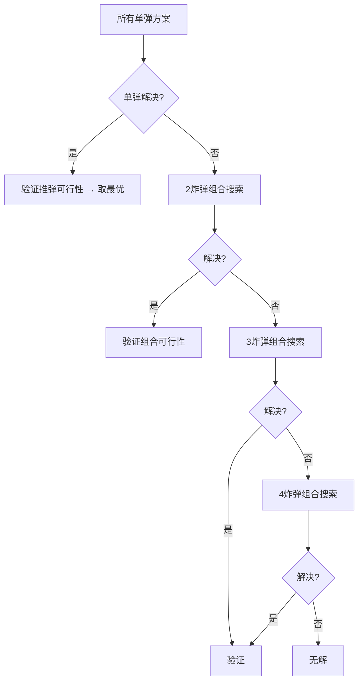

# 智能路径规划系统 (SmartEyes Path Planning)

## 📋 项目概述

本项目是一个面向推箱子（Sokoban）类问题的智能路径规划算法库，使用 **C 语言** 实现，运行于嵌入式/桌面环境。系统集成了 **4 种工作模式**，覆盖从简单接近到复杂炸弹破局的全场景路径求解。

**核心能力：**
- 推箱子最优路径搜索（A* + 转向惩罚）
- 多箱子-多目标智能配对（贪心 + 回溯验证）
- ID 感知学习与推理（观察 → 记录 → 推断配对）
- 死锁检测与炸弹破局分析（炸墙消除死锁）

**地图规格：** 12 行 × 16 列，最大支持 5 个箱子、4 枚炸弹。

---

## 🏗️ 系统架构

```
┌─────────────────────────────────────────────────────┐
│                    顶层接口层                         │
│  path_start_calculation  path_calculation            │
│  path_look_calculation   path_id_calculation         │
│  path_boom_calculation   map_boom_out               │
├─────────────────────────────────────────────────────┤
│                    模式算法层                         │
│  ┌──────────┐ ┌──────────┐ ┌──────────┐ ┌─────────┐ │
│  │ START    │ │ 模式1    │ │ 模式2    │ │ 模式3   │ │
│  │ 最近接近 │ │ 贪心配对 │ │ ID学习   │ │ 炸弹    │ │
│  │          │ │ 回溯验证 │ │ 推理配对 │ │ 破局    │ │
│  └──────────┘ └──────────┘ └──────────┘ └─────────┘ │
├─────────────────────────────────────────────────────┤
│                   核心算法层                          │
│  ┌─────────┐ ┌─────────┐ ┌─────────┐ ┌───────────┐ │
│  │简单 A*  │ │推箱 A*  │ │BFS 距离 │ │推箱 BFS   │ │
│  │(转向惩罚)│ │(哈希去重)│ │(泛洪填充)│ │(死锁模拟) │ │
│  └─────────┘ └─────────┘ └─────────┘ └───────────┘ │
├─────────────────────────────────────────────────────┤
│                    数据层                             │
│  全局状态管理 · 位图压缩 · 哈希表 · 优先队列         │
└─────────────────────────────────────────────────────┘
```

---

## 🎯 四种工作模式

### 模式 0 — START 模式（最近元素接近规划）

**用途：** 从玩家当前位置出发，寻找最近的箱子或目标点，计算接近路径和方向角度。

**算法流程：**
1. 扫描地图上所有 `BOX` 和 `TARGET` 元素
2. 对每个元素尝试四个方向的接近位置（相邻空地）
3. 使用 **simple A\*** 计算玩家到各接近点的最短路径
4. 选择路径最短的元素作为目标
5. 提取路径拐点（仅保留方向变化的关键点）
6. 计算最终接近角度（0°/90°/-90°/180°）

**输出：** `Path_Start` — 拐点路径 + 接近角度 + 元素类型

**关键函数：** `find_nearest_approach()` → `extract_start_turn_points()`

---

### 模式 1 — 科目一（非 ID 推箱子）

**用途：** 在已知全部箱子-目标配对的情况下，自动规划完整的推箱子执行路径。

**两阶段算法：**

#### 阶段 1：贪心配对
- 对每个箱子执行 BFS 计算到所有目标的距离
- 每次为当前箱子选择**最近且未使用**的目标
- 生成初始配对方案 `BoxTargetPair[]`

#### 阶段 2：回溯验证
采用**深度优先搜索 + 剪枝**的策略验证方案可行性：
1. 按玩家到箱子接近点的距离排序（近的优先尝试）
2. 对每个未解决的箱子，执行**推箱 A\*** 搜索最优路径
3. 若推箱成功，更新玩家位置、记录路径、递归验证剩余箱子
4. 若后续步骤失败，回退尝试下一个候选箱子
5. 所有箱子推到目标 → 方案有效

**关键优化：**
- **非配对靶位阻挡**：将非配对目标点加入 `wall_bitmap`，从源头阻止 A* 生成箱子穿越错误靶位的路径；目标点位图 `g_target_bitmap[12]` 实现 O(1) 放行玩家
- **事后轨迹验证**：模拟箱子沿 A* 路径的实际移动，位图 O(1) 确认每次推动后箱子不落在非配对靶位上
- **角死锁（corner deadlock）预检剪枝**
- **路径去重**（连续两步方向不变时不重复记录）

> 模式二中同一 ID 可能对应多对箱子-目标，系统自动识别：仅阻挡 **同ID** 的非配对靶位，放行异ID靶位。

**输出：** `Path` — 完整路径点 + 推动标记，经拐点提取压缩

---

### 模式 2 — 科目二（ID 推箱子）

**用途：** 模拟"观察 → 记录 ID → 推理配对"的智能感知流程。适用于箱子与目标带有数字 ID 的场景。

**三阶段流程：**

#### 阶段 1：ID 学习 (id_learning)
生成**观察访问计划**：
- 以 BFS 距离为度量，每次选择最近的未访问箱子或目标
- 记录接近位置、方向、角度
- 两趟遍历：先全遍历确定"最后一个"元素，再生成排除最后一个的访问序列
- 最后剩下一个元素不访问（留给推理阶段处理）

#### 阶段 2：ID 记录 (id_input → id_record)
- 用户（或传感器）在观察点扫描 ID
- 记录 `box_id_map[i] = id` 和 `target_id_map[i] = id`

#### 阶段 3：ID 推理 (id_inference)
核心逻辑——**频次平衡 + 多配对优化**：
1. **频次统计**：统计每个 ID 下已记录的箱子数和目标数
2. **频次平衡**：将多出的未配对元素分配给 ID 较少的类别
3. **新 ID 分配**：剩余未配对元素两两配对，分配新 ID
4. **多配对优化**：对同一 ID 下多个箱子-目标对，穷举所有排列，选择曼哈顿距离**总和最小**的最优匹配
5. 构造最终配对方案，调用 **推箱 A\*** 验证并生成路径

> **同ID多对处理**：当同一 ID 对应多个箱子-目标对时，系统自动启用 ID 感知的靶位阻挡——当前箱子只被同ID的非配对靶位阻挡，可自由穿过异ID靶位。

**输出：** `Path_Look`（观察阶段）+ `Path`（推理后推箱路径）

---

### 模式 3 — 炸弹破局分析

**用途：** 当推箱子出现**死锁**（箱子无法推入任何目标）时，利用地图中的炸弹炸毁墙壁，重新规划可行路径。

**五阶段算法：**

#### 阶段 1：死锁检测 (detect_and_generate_problems)

对每个箱子做**影响域分析**（BFS 遍历箱子可达区域），分类为四种死锁问题：

| 类型 | 标记 | 含义 | 解决策略 |
|------|------|------|---------|
| 封闭区域 | `PROBLEM_ENCLOSED` | 箱子所在区域玩家无法进入 | 炸开区域边界墙 |
| 分隔死锁 | `PROBLEM_SEPARATED` | 箱子可达域不含任何目标 | 炸墙连通到目标区域 |
| 待验证 | `PROBLEM_NEED_SIM` | 连通性 OK 但推箱 BFS 确认死锁 | 炸掉箱子周围的墙 |
| 目标不可达 | `PROBLEM_TARGET_UNREACHABLE` | 无箱子能推到该目标 | 炸掉目标周围的墙 |

**推箱 BFS 死锁验证** (`simulate_box_deadlock`)：
- 使用 16 位压缩状态编码 `(px:4, py:4, bx:4, by:4)` 节省内存
- epoch 技术避免全零 memset
- BFS 遍历所有可能的（玩家位置, 箱子位置）组合
- 若任意时刻箱子到达任意目标 → 非死锁
- 队列耗尽仍无解 → 真死锁

#### 阶段 2：可炸墙搜索

- **封闭区域**：遍历区域掩码边界上的可炸墙
- **分隔死锁**：查找连通区域与外部区域的边界墙
- **推箱死锁**：箱子四邻的墙
- **目标不可达**：目标区域边界墙 + 目标四邻墙

#### 阶段 3：爆炸方案生成 (generate_plans_for_walls)

对每堵可炸墙：
1. 查找有效的**引爆点**（爆炸 3×3 范围覆盖该墙的非边界空地）
2. 枚举每个炸弹，检查炸弹能否到达引爆点邻格
3. 评估**摧毁墙集**（一次爆炸可覆盖的墙列表）
4. 计算**收益分数** = 推弹距离 + 摧毁墙收益（负值，越小越优）
5. 使用**增量死锁验证**检查炸墙后问题是否解决
6. 快速预检炸弹第一步能否被推动（剪枝）

**验证缓存**：使用 `hash(walls) → resolved_mask` 缓存，避免重复计算。

#### 阶段 4：多炸弹组合搜索 (search_multi_bomb_combination)



- 每个炸弹保留 Top-K 个最佳方案
- 按收益排序，剪枝优化（累计收益 ≥ 当前最优时提前终止）
- 临时禁用已使用炸弹进行增量验证

#### 阶段 5：推弹顺序规划 (plan_bomb_execution_sequence)

- **BFS 贪心**：从玩家位置开始，每次选择最近的炸弹执行推弹+引爆
- 更新地图状态（炸毁的墙变为空地，炸弹消失）
- 若贪心失败（部分炸弹无法推入引爆点），回退到**全排列搜索**
- 每个炸弹视为可推的"箱子"，推弹路径用推箱 A* 计算

**输出：**
- `Path` — 完整的玩家路径（含所有推弹和移动步骤）
- `map_boom_out()` — 输出炸弹引爆后的新地图（墙被清除、炸弹移除）

---

## 🔬 核心算法详解

### 1. 简单 A* 寻路 (simple_astar)

```
f = g + 1.2 × h    （加权启发式，加速搜索）
h = |dx| + |dy|    （曼哈顿距离）
```

**特性：**
- **最小堆**优化，`O(N log N)` 复杂度
- **转向惩罚**：方向变化时额外代价 `TURN_WEIGHT = 4`
- **状态空间**：坐标 × 5 种方向状态（4 方向 + 初始）
- 适用于无推箱的纯移动路径规划

### 2. 推箱 A* (solve_single_box_a_star)

**状态定义：** `(player_x, player_y, box_x, box_y, last_dir, wall_bitmap[])`

**优化技术：**
| 技术 | 说明 |
|------|------|
| **哈希表去重** | 线性探测哈希表，50000 槽位，djb2 哈希 |
| **优先队列** | 最小堆按 f 值排序，10000 容量 |
| **搜索上限** | 50000 步自动终止，防止无限循环 |
| **角死锁剪枝** | 箱子推到角落时立即丢弃该后继 |
| **非配对靶位拦截** | 模式1阻挡全部非配对靶位；模式2仅阻挡同ID非配对靶位 |
| **目标点位图** | `g_target_bitmap[12]` 实现玩家/靶位 O(1) 碰撞判定 |
| **转向惩罚** | 方向变化增加 4 代价，鼓励直线路径 |

### 3. BFS 泛洪填充

用于计算距离图、可达区域、影响域等多种场景。

**优化技术：**
- **epoch 标记**：`g_bfs_visited`、`g_vis1`、`g_player_region`、`g_dist_epoch_tag` 均采用 epoch 自增计数器代替全局 memset，`O(1)` 重置
- **位图压缩**：墙信息用 `uint16_t[12]` 位图存储，`O(1)` 查询
- **共享队列**：全局 BFS 队列复用

### 4. 推箱 BFS 死锁模拟

**状态压缩：** 4 个坐标各 4 位 → `uint16_t` 单编码

```
ENCODE_STATE(px, py, bx, by) = px<<12 | py<<8 | bx<<4 | by
```

**访问标记：** 使用 `g_bfs_visited[12×16×12×16]` 数组 + epoch 技术

**算法逻辑：**
1. 将当前模拟箱子外的所有其他箱子视为永久障碍
2. 对每个状态，BFS 计算玩家可达区域
3. 尝试从四个方向推动箱子
4. 若箱子到达目标 → 非死锁
5. 队列耗尽 → 真死锁

---

## 📊 数据结构总览

| 数据结构 | 用途 | 容量 |
|---------|------|------|
| `HashMap[MAX_OPENSET]` | 推箱 A* 状态哈希表 | 50000 |
| `PQ[MAX_PQ_SIZE]` | 推箱 A* 优先队列 | 10000 |
| `PathNode[]` | simple A* 路径节点 | 12×16×5 |
| `SimState[MAX_SIM_QUEUE]` | 推箱模拟 BFS 队列（压缩） | 16384 |
| `g_bfs_visited[]` | 推箱模拟访问标记 | 12×16×12×16 |
| `g_dist_map[12][16]` | BFS 距离图 | 192 格 |
| `g_static_walls[12]` | 静态墙位图 | 12 × uint16_t |
| `g_target_bitmap[12]` | 目标点位图（O(1) 碰撞查询） | 12 × uint16_t |
| `g_bomb_reach_map[4][12]` | 炸弹可达性缓存 | 4 × uint16_t |
| `g_problem_points[10]` | 死锁待解决点 | 10 个 |
| `g_vcache[2048]` | 增量验证缓存 | 2048 项 |

---

## 🧪 测试地图

### 普通推箱地图 (`g_map_test`)
```
1 1 1 1 1 1 1 1 1 1 1 1 1 1 1 1
1 . . . . . . . . . . . . . T 1
1 . . . . . . . . . . . . . T 1
1 . . . 1 . . . B . . . . . . 1
1 . . 1 . . . . B . . . . . . 1
1 . . . 1 . 1 . . . . . . . . 1
1 . . . . . . T . 1 . 1 . . . 1
1 . 1 P . . . . . . . . 1 . . 1
1 . . B . . 1 . . . B . 1 . . 1
1 1 . . . 1 . B . . . . . . . 1
1 . . . . 1 . T . . . . . . T 1
1 1 1 1 1 1 1 1 1 1 1 1 1 1 1 1
```
- 箱子 (B): 4 个，目标 (T): 5 个
- 适用于模式 0、1、2 测试

### 炸弹破局地图 (`g_map_test_bomb_complex`)
```
1 1 1 1 1 1 1 1 1 1 1 1 1 1 1 1
1 . 1 . . . 1 . . 1 . . . . T 1
1 . . . 1 . . 1 . 1 1 1 1 . . 1
1 1 . 1 1 1 . 1 . 1 . . . . . 1
1 . T 1 . 1 . 1 . 1 . . 1 . . 1
1 . 1 1 . 1 . . . . . . . . . 1
1 . P 1 . . . . . . . 1 1 . . 1
1 . B . . . . . . . B . 1 . . 1
1 . . B . 1 . . . . . B B . . 1
1 . B . . 1 1 1 1 1 1 1 1 . . 1
1 . . . . 1 T . . . . . . . . 1
1 1 1 1 1 1 1 1 1 1 1 1 1 1 1 1
```
- 炸弹 (B=7): 4 枚，箱子 (B): 3 个，目标 (T): 2 个
- 适用于模式 3 测试

---

## 🚀 构建与运行

### 环境要求
- GCC 编译器（支持 C99 以上标准）
- 或任何兼容 C 语言的嵌入式开发环境

### 编译命令

```bash
# 调试模式
gcc -Wall -Wextra -Wpedantic -Wshadow -Wformat=2 -Wcast-align \
    -Wconversion -Wsign-conversion -Wnull-dereference \
    -g3 -O0 -c path_planning.c -o build/Debug/path_planning.o
gcc build/Debug/path_planning.o -o build/Debug/outDebug.exe -lm

# 发布模式
gcc -O2 path_planning.c -o path_planning.exe -lm
```

### 运行

```
===== 路径规划系统 =====
请选择模式:
  0 - START模式：最近元素接近规划
  1 - 科目一（非ID推箱子）
  2 - 科目二（ID推箱子）
  3 - 炸弹破局分析（含推炸弹路径）
选择:
```

---

## 🔗 外部接口 API

| 函数 | 说明 |
|------|------|
| `Path_Start path_start_calculation(map)` | START 模式：最近元素接近 |
| `Path path_calculation(map)` | 模式 1：推箱子完整路径 |
| `Path_Look path_look_calculation(map)` | 模式 2：ID 学习观察路径 |
| `void id_input(int id)` | 模式 2：记录扫描到的 ID |
| `Path path_id_calculation(void)` | 模式 2：推理并计算推箱路径 |
| `Path path_boom_calculation(map)` | 模式 3：炸弹破局主路径 |
| `void map_boom_out(out_map)` | 模式 3：输出引爆后地图 |
| `void reset_planning_system(void)` | 重置所有全局状态 |

---

## 💡 设计亮点

1. **内存高效**：状态压缩（4 坐标 → 16 位）、位图墙表示、epoch 标记避免 memset
2. **剪枝充分**：角死锁预检、非配对目标拦截、推弹可行性预检、收益排序剪枝
3. **多策略死锁解决**：封闭区域、分隔死锁、推箱验证、目标不可达四种分类处理
4. **缓存加速**：增量验证结果缓存 (`wall_hash → resolved_mask`)，避免重复推箱 BFS
5. **推弹路径规划**：贪心 + 全排列回退，确保多炸弹场景下找到可行执行顺序
6. **模块化设计**：清晰的分层架构（工具层 → 算法层 → 模式层 → 接口层）

---

## 📝 许可

本项目为 SmartEyes 路径规划子系统。
