# 技术报告

> 燕山大学第 21 届全国大学生智能汽车竞赛人工智能视觉组
> 2026 年 8 月

本文件是参赛技术报告的 Markdown 版，便于在仓库内检索与版本管理。排版后的提交版见同目录 `燕山大学_燕视队_智能视觉.docx`，图片见 `images/`。

## 勘误说明

本版相对提交版 docx 只修正笔误、对齐代码参数，技术内容未改动：

| #   | 位置                  | 提交版                 | 本版                        | 依据                                     |
| --- | --------------------- | ---------------------- | --------------------------- | ---------------------------------------- |
| 1   | 表 5-3 X/Y 位置环参数 | 3.50 / 0.003 / 7.00    | 3.60 / 0.003 / 7.50         | `project/code/menu.c:13-19` 实际默认值   |
| 2   | 第七章 车模尺寸       | 282 × 120 × 1500 mm    | 282 × 120 × 150 mm          | 1500 mm 按整车尺寸判断为笔误，待队员确认 |
| 3   | 第七章 参数项         | 所有电容总容量 2200mAh | 电池容量 2200 mAh           | 单位与量纲对应电池而非电容               |
| 4   | 附录 B.4 标题         | OPENMV 视觉数据帧解析  | OpenART_Plus 视觉数据帧解析 | 与全文及代码术语统一                     |
| 5   | 3.2 节                | 车模底下哦啊           | 车模底下                    | 错字                                     |

## 摘要

针对第二十一届全国大学生智能汽车竞赛人工智能视觉组虚实融合的比赛任务，设计并实现了一套基于全局视觉定位与车载屏幕交互的全向移动智能车系统。系统以大赛指定 M 型车模为平台，采用四轮迈克纳姆轮全向驱动；以 NXP RT1064 微控制器为核心，构建了「感知—决策—控制」三层软件架构。

感知层由四路 1024 线正交编码器、IMU963RA 姿态传感器与 OpenART_Plus 视觉模块构成：编码器经四倍频与迈克纳姆轮运动学解算得到车体里程计，IMU 经自适应 Kp 的 Mahony 互补滤波解算航向角，视觉模块识别车载屏幕上的虚拟游戏元素并下发 12×16 栅格地图与小车全局坐标。决策层采用七状态状态机（NoGame、GameMap、Waiting、Look、Run、GameOver、End）调度路径规划，实现起点搜索、盲推、ID 扫描、ID 推箱与炸弹破墙五种规划模式，单箱推箱求解采用附加转向代价的 A\* 算法。

控制层在 5 ms 定时中断中执行「位置环—偏航环—速度环」三级串级 PID，经迈克纳姆轮运动学合成分解为四轮独立转速，并引入加减速规划抑制惯性冲击。经场地实测，整车重量 2.2 kg，运动控制周期 5 ms，位置控制精度在 1 个栅格以内，能够稳定完成三局推箱游戏的全部任务。

**关键词**：智能汽车竞赛；人工智能视觉组；虚实融合；RT1064；串级 PID；A\* 路径规划

## 第一章 引言

全国大学生智能汽车竞赛秉承「立足培养、强调参与、倡导探索、追求卓越」的理念，致力于为全国各高校学子提供一个开展探索性工程实践的平台。竞赛要求参赛团队在特定赛道上设计制作出能够自主行驶且性能卓越的智能模型汽车，鼓励学生组成团队，融汇多领域知识，从机械结构、电子线路、运动控制到开发与调试工具等多个问题领域进行深入分析、设计、研发。这不仅激发了学生投身工程技术与科研探索的兴趣，更倡导了将理论融入实践、注重真实解决问题的学风，以及强调团队合作的人文精神。

人工智能视觉组是赛事对于「虚实结合」的竞赛项目的大胆创新，车模在真实场地中运动，但其任务目标、环境交互和决策依据都来自虚拟现实仿真系统。智能车模需通过识别车载屏幕上的虚拟游戏画面，自主导航并完成推箱子等指定任务，以将所有箱子推至目的地的最短用时作为成绩。

我们团队在这几个月的努力中习得了电路设计、软件编程、系统调试等方面的能力，锻炼了知识融合和实践动手的能力，对今后的学习工作都有着重大的实际意义。在这份报告中，我们小组通过对小车设计制作整体思路、电路、算法、调试、车辆参数的介绍，阐述了我们的思想和创意。

## 第二章 总体技术方案

### 2.1 设计目标

本系统的总体目标是，在尺寸为 3.2 m × 2.4 m 的矩形场地内，构建一套依托全局视觉定位与车载屏幕交互的虚实融合控制系统，使车模能够自主完成虚拟推箱子游戏任务。车模由顶部的全局摄像头（彩钻风）采集其标识牌和场地四角的 AprilTag 码，生成包含箱子、目的地和围墙等元素的虚拟游戏界面，然后将场地与车模信息简化后下发至车载无线屏幕。随后，车载视觉处理平台（OpenART_Plus）实时采集屏幕画面，通过颜色分割、形状匹配和轻量级分类网络识别各游戏元素的类别、坐标及模型 ID，并将数据打包发送给主控芯片。主控芯片 NXP RT1064 接收数据后，进行路径规划算法，并结合全局位姿反馈，通过闭环控制算法精确驱动车模底盘，实现精准的移动、速度和位置控制，确保推动虚拟箱子时的动作可靠性。整个「感知—决策—控制」闭环延迟需控制在 100 ms 以内。

### 2.2 整体方案设计

根据竞赛规则相关规定，基于大赛组委会指定的 M 型车模，以 NXP 公司生产的微控制器 RT1064 作为核心控制器，在 Keil 5 开发环境中进行软件开发。小车利用 IMU963RA 获取当前小车的角加速度和角速度来解算偏航角，利用正交编码器来获得四轮转速，并且通过编码器数据积分计算得到运动位置来计算小车在场地的坐标，主控通过这些数据进行 PID 闭环（速度环 + 角度环 + 位置环）用于小车的运动控制决策。

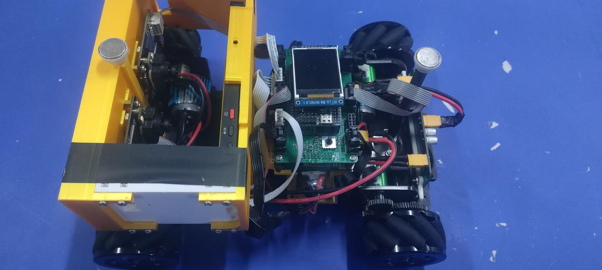

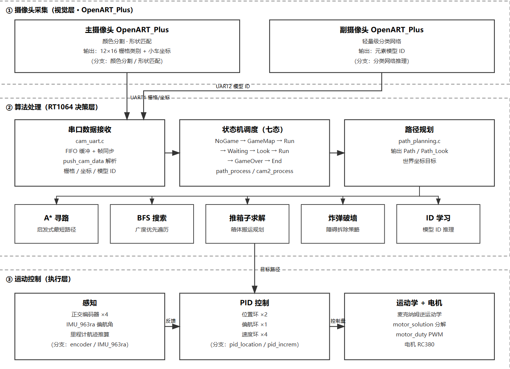

## 第三章 机械结构设计与安装

### 3.1 车模平台

针对矩形场地内四向水平移动的任务要求，车体须具备全向运动能力，综合考虑组委会允许的车模的具体性能，最后选择使用 M 车模作为执行机构。

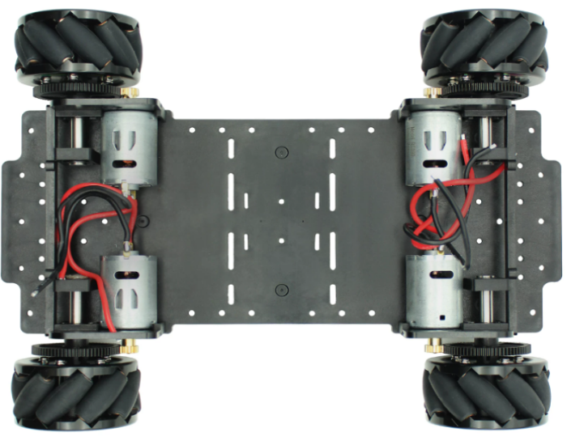

### 3.2 传感器安装

速度传感器主要是由编码器构成，我们选择的是 1024 线方向迷你编码器，编码器将位移转换成周期的电信号，再把这个电信号转变成计数脉冲。在固定时间间隔内的速度脉冲信号个数可以反映电机的转速。编码器安装位置如图。

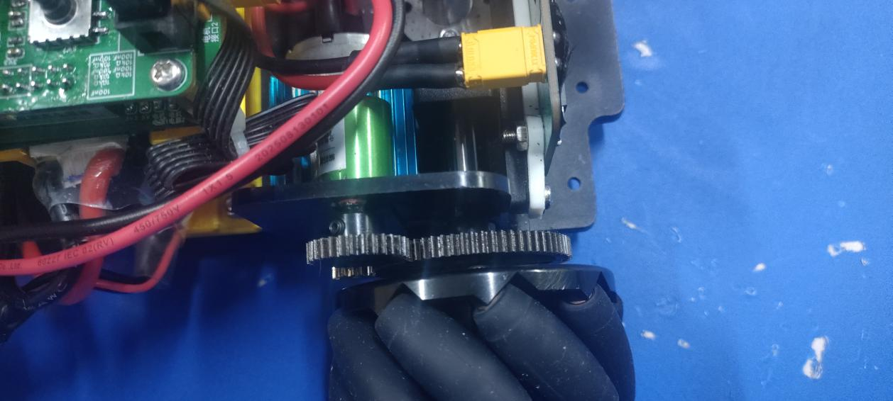

姿态传感器我们使用了 IMU963RA，相较于多组件方案，免除了组合陀螺仪与加速器时间轴之差的问题，减少了大量的封装空间。IMU963RA 属于新一代的传感器，陀螺仪零偏和温漂均小于 IMU660RA，该模块使用硬件 SPI 可以达到 10M 速率。安装位置如图。

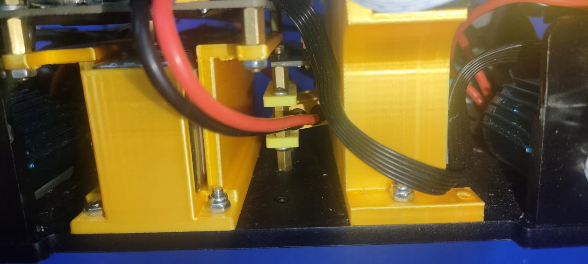

对于整个车来说，摄像头和屏幕的安装影响到对地图数据采集的准确性。在摄像头安装过程中，我们充分考虑摄像头和屏幕的相对位置和稳定性，同时为了避免外界光线对摄像头的干扰，我们设计了摄像头和屏幕的一体化结构件来固定二者。安装方式如图。

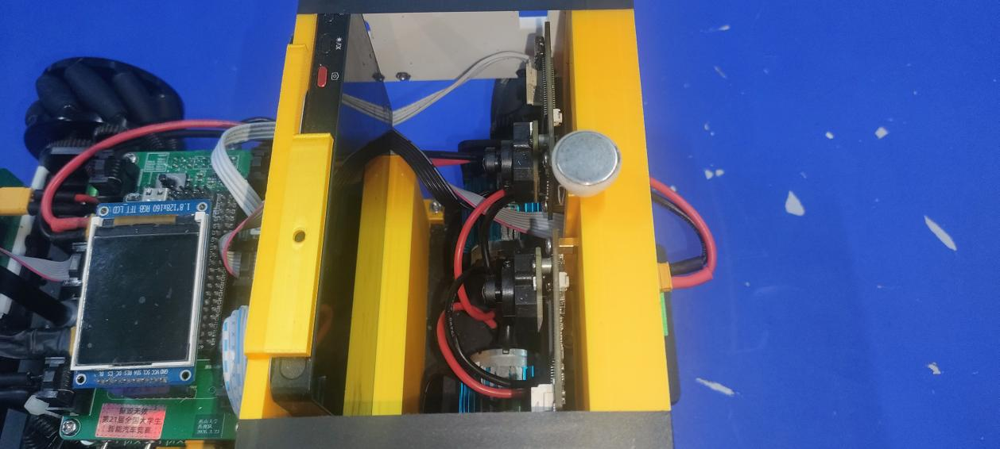

在考虑到摄像头和屏幕已经占据了车模的一半空间，电池无法放置在其下方或车模底下，则将电池放置主板的下方并架高主板，以此使得主板和摄像头结构件高度一致，方便人机交互的操作。安装位置如图。

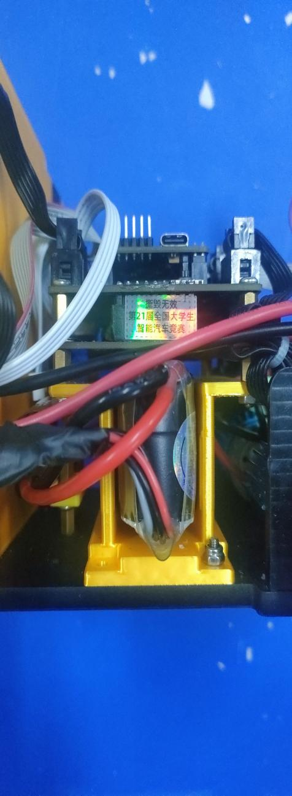

### 3.3 电路板固定与连接

在考虑到摄像头和屏幕已占据了车模一半的空间，则主板和电池只能安装在车模的另一半位置，考虑到主板需要承担供电、四个编码器接口、两个摄像头接口、两个电驱接口、核心板、TFT 屏幕、按键等需求的情况下，采用分体式主板将供电功能分离到下板以缓解上板的布局压力，上板只负责主体信号与交互部分。安装方式如图。

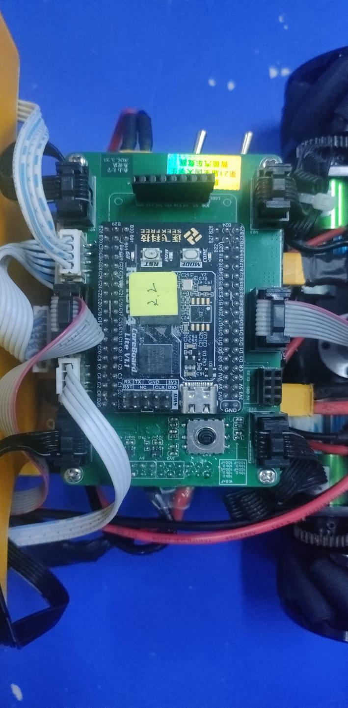

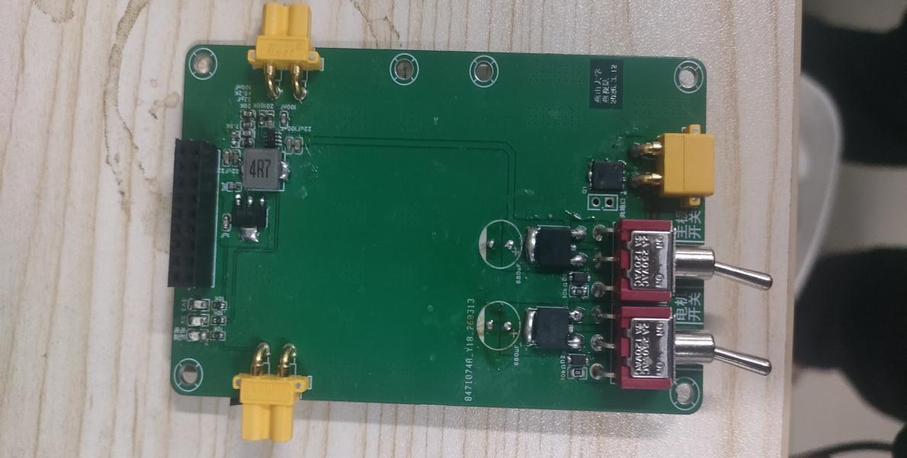

## 第四章 电路设计

### 4.1 电源电路

使用 MP2315 芯片的 12V 转 5V 的 Buck 电路，负责为整个系统提供稳定的 5V 工作电压。该电路中，输入的 12V 电源经 4.7 µH 电感 U2 进行储能与换流，并通过由电阻 R4、R3、R5 组成的反馈网络来精确设定 5V 的输出电压，同时电容 C9 与电阻 R5 构成的补偿网络确保了环路稳定性，而 R2 和 C5 组成的自举电路则为芯片内部的高侧 MOS 管提供了必要的驱动电压，输出的 5V_BUCK 电源供给后续的驱动和逻辑电路使用。

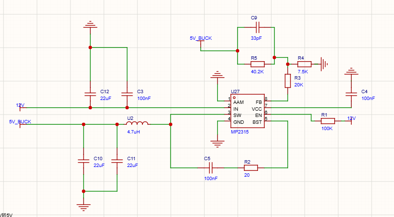

### 4.2 电机驱动电路

电机驱动模块采用信号隔离与双路独立大功率驱动相结合的拓扑结构，前级通过 SN74HC125PWR 缓冲器增强主控 PWM 信号的驱动能力，并配合输入端的下拉电阻确保系统上电瞬间信号不被悬空，有效避免了驱动级因控制信号不明而产生的误动作；后级双通道核心均采用 HIP4082IBZT 栅极驱动器，通过外接四颗 TM60N02D N 沟道 MOSFET 构成经典 H 桥，配合外围自举二极管和电容解决高侧栅极驱动电压问题，实现了 12V 至 24V 有刷直流电机的稳定双向控制，且在每颗功率管的栅极均串接了 10 Ω 电阻以抑制高频开关振荡。该方案通过 XT30 接口接入 12-24V 主电源和 5V 逻辑电源，整体结构简洁，具备良好的上电安全性与抗干扰性能。

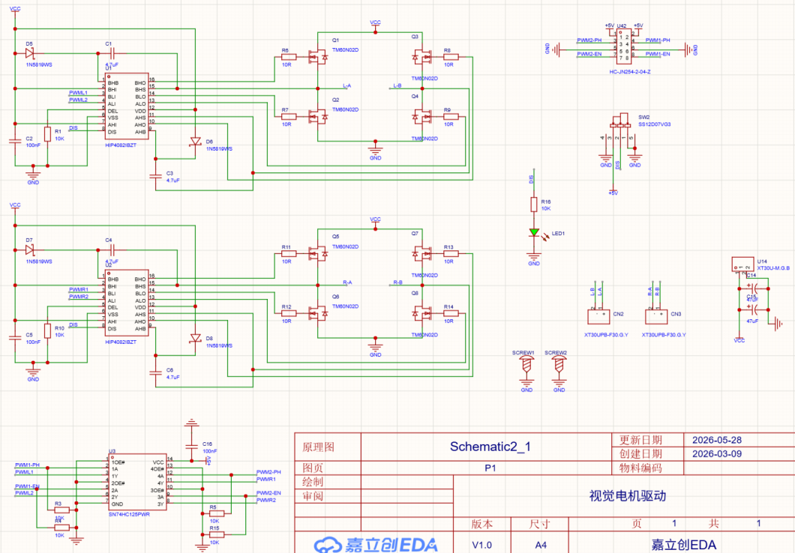

### 4.3 辅助调试电路

使用 TFT180 屏幕作为显示模块，五向按键作为调试输入模块，既减小了占用空间，又保证调试的便利性。

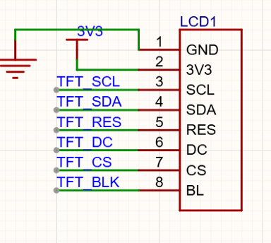

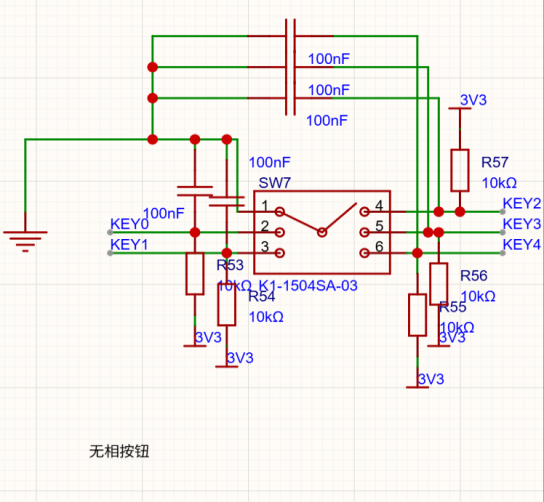

## 第五章 软件算法设计

### 5.1 软件总体架构

系统软件采用裸机架构，所有实时控制逻辑运行于 PIT 定时器中断中：PIT_CH0 以 5 ms 周期执行运动控制链路，PIT_CH1 以 10 ms 周期接收 OpenART_Plus 视觉数据；main() 主循环仅负责状态机调度与非实时任务，从而保证控制环路的硬实时性与执行确定性。

软件按「感知—决策—控制」三层结构组织：感知层由四路正交编码器、IMU963RA 姿态传感器与 OpenART_Plus 视觉模块构成；决策层基于 12×16 栅格地图运行路径规划算法；控制层实现「位置环—偏航环—速度环」三级串级 PID。软件总体架构如图 5-1 所示。

系统整体数据流为：OpenART_Plus 通过串口下发小车全局坐标与栅格地图，状态机调度路径规划生成目标栅格坐标，位置环将栅格坐标转换为期望速度，运动学合成将（vx, vy, wz）分解为四轮期望转速，速度环输出 PWM 占空比驱动电机，编码器与 IMU 的反馈构成闭环。

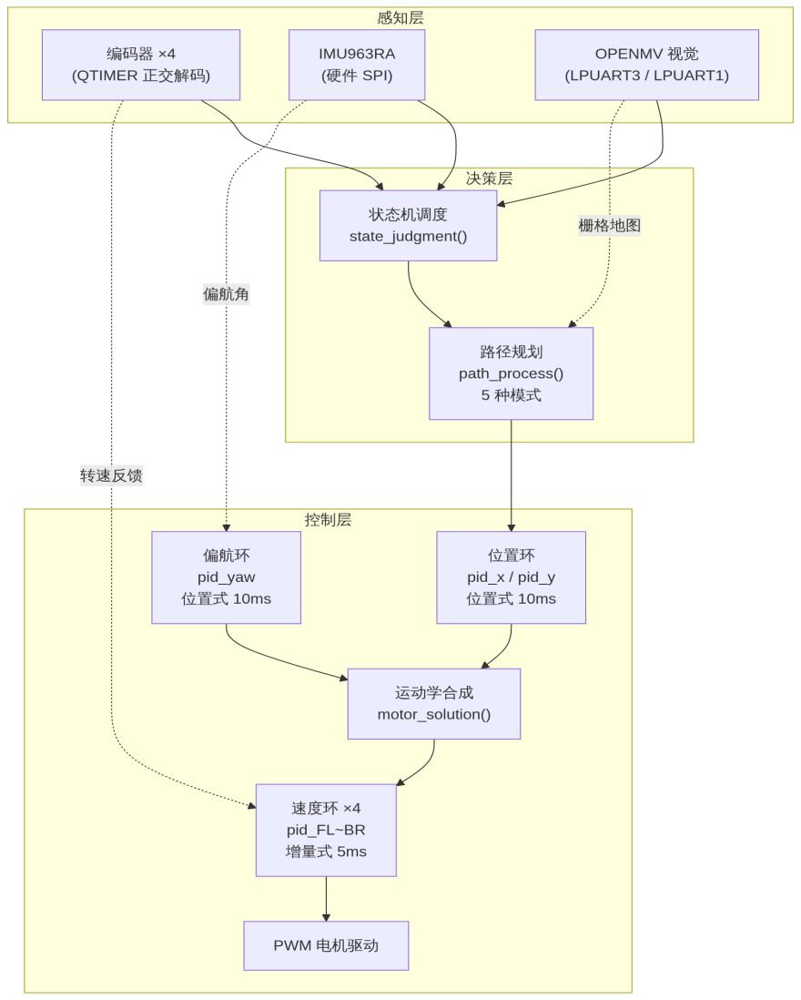

系统状态机共包含 7 个状态：NoGame（待机）、GameMap（地图初始化）、Waiting（路径规划）、Look（ID 扫描）、Run（行驶）、GameOver（游戏结束判定）、End（终止）。状态转换关系如图 5-2 所示，转换条件如表 5-1 所示。

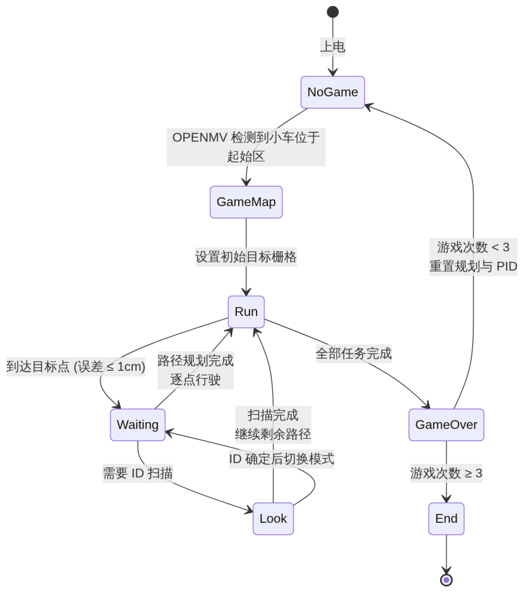

表 5-1 状态机转换条件表

| 当前状态 | 转换条件                                     | 下一状态      | 关键动作                         |
| -------- | -------------------------------------------- | ------------- | -------------------------------- |
| NoGame   | OpenART_Plus 检测到小车位于起始区            | GameMap       | 以摄像头全局坐标初始化里程计     |
| GameMap  | 无条件                                       | Run           | 设置初始目标栅格（起点栅格中心） |
| Run      | \|x_enc−x_target\|≤1 且 \|y_enc−y_target\|≤1 | Waiting       | 停止运动，调用 path_process()    |
| Waiting  | 路径规划完成，存在待行驶目标点               | Run           | 按路径逐点行驶                   |
| Waiting  | 路径需要模型 ID 扫描                         | Look          | 调用 cam2_process()              |
| Look     | ID 扫描完成                                  | Run / Waiting | 依据 ID 切换规划模式             |
| Run      | 全部任务完成                                 | GameOver      | 冲线提速（pid_position_speed()） |
| GameOver | 游戏次数 ≥ 3                                 | End           | 停车，任务结束                   |
| GameOver | 游戏次数 < 3                                 | NoGame        | 重置路径规划与 PID 状态          |

在 NoGame 状态下，OpenART_Plus 检测到车模位于起始区后，用摄像头全局坐标初始化里程计，消除编码器累计误差；GameMap 状态设置初始目标栅格；Run 状态下到达目标点后进入 Waiting，由 path_process() 完成路径规划；需要识别模型 ID 时转入 Look 状态，通过双串口与视觉模块交互；完成三局游戏后进入 End 状态停车。

### 5.2 传感器数据处理

编码器数据处理：四路 1024 线正交编码器经 4 倍频后每圈产生 16384 个计数脉冲，机械传动比为 30/70，车轮直径 3.0 cm。电机齿槽效应与齿轮间隙会使转速信号产生高频抖动，先对原始计数值执行一阶低通滤波（滤波系数 α=0.9），再按迈克纳姆轮运动学模型解算车体坐标系位移，最后根据当前偏航角旋转至世界坐标系并累加，得到全局坐标 x_enc/y_enc。为补偿轮径加工误差与地面打滑，累加时乘以标定系数 corr_x_enc/corr_y_enc。里程计解算过程见附录 B.3。

姿态解算：IMU963RA 通过硬件 SPI 以 10 Mbit/s 速率读取。上电时连续采集 700 次（5 ms 间隔）求平均作为陀螺仪与加速度计零偏；原始数据经单位换算后分别执行一阶低通滤波；随后采用 Mahony 互补滤波算法融合加速度计与陀螺仪数据更新四元数，并将四元数转换为欧拉角提取偏航角 yaw。考虑到小车加减速时加速度计测量值偏离重力加速度，Mahony 算法比例系数 Kp 采用自适应策略：加速度模长偏离 1g 越远，对加速度计的信任度越低，从而抑制运动加速度对姿态估计的干扰。算法实现见附录 B.2。

OpenART_Plus 视觉数据接收：LPUART3 以 115200 波特率逐字节中断接收，写入 512 字节环形 FIFO；主程序每 10 ms 提取一帧，按帧头「start」与帧尾「end」定位帧边界，解析 car:x,y 小车全局坐标与 map: 开头的 192 位栅格数字串（12 行 × 16 列），生成栅格地图 CAMDATA.grid[12][16]。帧解析实现见附录 B.4。

### 5.3 虚拟场景识别与地图信息解析

竞赛场地中不存在赛道线信息，车模的任务依据完全来自车载屏幕上的虚拟游戏画面，因此本节描述虚拟场景的识别与地图信息解析过程。

OpenART_Plus 视觉模块采集车载屏幕画面，通过颜色分割、形状匹配与轻量级分类网络识别箱子、目标点、围墙、炸弹等游戏元素，并依据车模标识牌识别车模在场地中的全局位置，将 3.2 m × 2.4 m 的场地栅格化为 12×16 栅格地图。栅格数字的含义如表 5-2 所示。

表 5-2 栅格地图元素定义

| 栅格值 | 含义           | 栅格值 | 含义             |
| ------ | -------------- | ------ | ---------------- |
| 0      | 地板（可通行） | 3      | 箱子             |
| 1      | 墙（不可通行） | 6      | 目标点           |
| 2      | 小车（玩家）   | 7      | 炸弹（可炸毁墙） |

栅格地图经串口下发至主控后，存储于 CAMDATA.grid，路径规划模块直接读取该地图执行 A\* 搜索与任务规划。小车全局定位方面，视觉模块同时下发车模在场地中的全局坐标，状态机在 NoGame 至 GameMap 转换时以此初始化里程计，此后行驶过程由编码器积分定位，既保证绝对定位精度，又兼顾高频更新率。

### 5.4 运动控制算法

运动控制采用「位置环—偏航环—速度环」三级串级 PID 结构，全部在 PIT_CH0 5 ms 中断中执行，其中位置环与偏航环每 10 ms 计算一次，速度环每 5 ms 计算一次。各级控制器参数如表 5-3 所示，控制框图如图 5-3 所示。

表 5-3 三级 PID 控制器参数

| 控制环    | 周期  | 类型   | kp     | ki     | kd    | 最大输出 | 说明           |
| --------- | ----- | ------ | ------ | ------ | ----- | -------- | -------------- |
| 速度环 ×4 | 5 ms  | 增量式 | 60     | 10     | 50    | 8000     | 四轮独立       |
| 偏航环    | 10 ms | 位置式 | 5 / 10 | 0.001  | 30    | 70       | Run 状态 Kp=10 |
| X 位置环  | 10 ms | 位置式 | 3.60   | 0.003  | 7.50  | 110      | 菜单可调       |
| Y 位置环  | 10 ms | 位置式 | −3.60  | −0.003 | −7.50 | 110      | 菜单可调       |

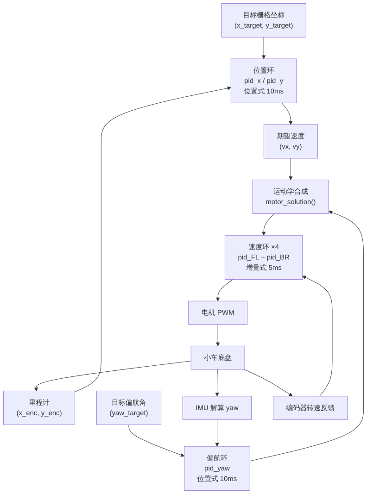

位置环：以目标栅格中心坐标为期望值，里程计输出 x_enc/y_enc 为反馈，采用位置式 PID 输出期望速度 vx、vy。X 与 Y 方向独立调节，比例、积分、微分系数及最大速度均可在菜单中在线修改。

偏航环：以目标偏航角为期望值，IMU 解算 yaw 为反馈，位置式 PID 输出旋转角速度 wz。针对偏航角 ±180° 边界跳变导致误差突变的问题，将误差归一化至 [-180°, 180°]；行驶（Run）状态下将 Kp 由 5 切换为 10，保证转向快速响应，其余状态保持平稳，避免抖动。

运动学合成：motor_solution() 将（vx, vy, wz）按迈克纳姆轮布置分解为四轮期望转速，由增量式速度环跟踪，输出 PWM 占空比 [-8000, 8000] 驱动电机。

加减速规划：驶向目标点时按菜单参数 x_acc/x_dec、y_acc/y_dec 控制速度的爬升与减速，减小惯性冲击，保证推箱动作的平稳可靠；进入 GameOver 状态后调用 pid_position_speed() 将位置环最大输出提升至 130，实现终点冲刺。

参数整定遵循「由内向外」原则：先整定速度环（给定阶跃转速，观察编码器响应调整增量式 PID 参数），再整定偏航环（以角度阶跃验证超调量与响应时间），最后整定位置环；全部参数通过 TFT 菜单在线修改并保存至 Flash，结合无线示波器观察实时波形完成收敛。

### 5.5 核心代码设计

工程代码按功能划分为 8 个模块，各模块职责与对外接口如表 5-4 所示。

表 5-4 软件模块划分

| 模块       | 源文件          | 职责                              | 对外接口                           |
| ---------- | --------------- | --------------------------------- | ---------------------------------- |
| 主控调度   | main.c          | 状态机调度、PIT 中断控制循环      | state_judgment()、path_process()   |
| 视觉通信   | cam_uart.c      | OpenART_Plus 双 UART 帧收发与解析 | cam_uart1_read()、cam_uart2_read() |
| 姿态解算   | imu963.c        | 零偏校准、Mahony 互补滤波         | imu_get()                          |
| 里程计     | encoder.c       | 编码器滤波与运动学解算            | encoder_get()、distance()          |
| PID 控制   | pid.c           | 三级闭环控制                      | pid_location()、pid_increm()       |
| 运动学合成 | control.c       | 四轮速度解算                      | motor_solution()                   |
| 路径规划   | path_planning.c | A\* 推箱、任务规划                | path_\*_calculation()              |
| 人机交互   | menu.c / key.c  | TFT 菜单调参与按键输入            | —                                  |

路径规划是决策层的核心，包含起点搜索、盲推、ID 扫描、ID 推箱、炸弹破墙五种模式，由 Waiting 状态下的 path_process() 依据栅格地图元素分派。规划搜索采用 A\* 算法：以「玩家位置 + 箱子位置 + 目标位置 + 墙体位图」构成搜索状态，曼哈顿距离为启发函数，65536 槽哈希表进行状态去重，二叉堆优先队列维护开放集，转向动作附加 4 倍步长代价以抑制无谓折返；单箱求解迭代执行 A\*，多箱分配采用贪心配对加回溯验证保证解的存在性。为满足 5 ms 控制周期内的实时性要求，solve_single_box_a_star 等 13 个热函数经 `__attribute__((section("ITCM_NonCacheable")))` 放入 ITCM 零等待执行，哈希表与优先队列置于 SDRAM，兼顾搜索规模与执行速度。单箱 A\* 求解源码见附录 B.6。

为便于现场调试，menu.c 实现 TFT 菜单系统，可在线修改 PID 参数、起点坐标、里程计修正系数、加减速系数共 19 个参数，保存至 Flash Sector 127，掉电不丢失。关键子程序代码见附录 B。

## 第六章 开发调试过程

### 6.1 开发工具与环境

软件开发环境：Keil MDK 5.33（ARM Compiler 5），目标芯片为 NXP MIMXRT1064DVL6A，工程采用 FlexSPI XIP 从外部 Flash 原地执行代码，SDRAM 用于存放哈希表等大数据结构；代码静态检查使用 clangd LSP。

调试工具：DAP-Link 调试器完成程序下载与在线调试；板载五向按键与 TFT180 屏幕构成菜单调试界面，支持在线修改控制参数；LPUART8 连接 SeekFree 无线示波器模块，可实时上传多通道数据，便于观察位置环、偏航环与速度环的响应波形；工程使用 git 进行版本管理，保证多人协同开发的一致性。

### 6.2 调试方法与记录

调试流程分模块进行、由内向外：先单独调试四轮速度环，给定阶跃目标转速，通过无线示波器观察编码器转速响应并整定增量式 PID 参数；再进行整车行走调试，位置环与偏航环协同，观察 x_enc/y_enc 的收敛过程。

里程计标定：在场地内直线行驶固定距离，对比编码器累计里程与真实距离，求得修正系数 corr_x_enc/corr_y_enc；同时利用全局坐标在起始区重置里程计，消除长时间行驶产生的累计误差。

调试中解决的典型问题：

1. 偏航角跨越 ±180° 时角度误差突变，导致小车反向旋转——将误差归一化至 [-180°, 180°] 后解决。
2. 加减速过程中运动加速度干扰 IMU，yaw 漂移明显——引入 Mahony 自适应 Kp，运动激烈时降低加速度计权重。
3. 转向时速度环输出饱和、响应迟缓——将积分限幅（maxIntegral）与输出限幅（maxOutput）分层设置，防止积分饱和。

最终整车运动参数见表 5-3，经多轮场地实测后写入 Flash 保存。

## 第七章 主要技术参数

| 参数项                           | 数值                                          | 备注     |
| -------------------------------- | --------------------------------------------- | -------- |
| 车模总重量（改造后）             | 2200 g                                        |          |
| 车模尺寸 长×宽×高（改造后）      | 282 × 120 × 150 mm                            |          |
| 电池容量                         | 2200 mAh                                      |          |
| 传感器种类                       | OpenART + IMU + 编码器                        |          |
| 传感器个数                       | 7 个                                          |          |
| 除驱动电机、舵机外的伺服电机个数 | 0 个                                          | 无则填 0 |
| 赛道信息检测频率                 | 速度检测 5 ms，角度检测 10 ms，位置检测 10 ms |          |

## 第八章 结论

本报告围绕第二十一届全国大学生智能汽车竞赛人工智能视觉组虚实融合任务，完成了基于 M 型车模的全向移动智能车的机械改造、电路设计、软件算法开发与整车联调全过程。系统以 RT1064 为核心控制器，融合四路编码器、IMU963RA 姿态传感器与 OpenART_Plus 视觉模块的感知信息，通过七状态状态机与附加转向代价的 A\* 算法实现虚拟场景下的路径规划与推箱任务，以三级串级 PID 保证运动控制的实时性与平稳性，最终实现了预期的比赛功能。

整车经改造后重量 2.2 kg，装配 7 个传感器，运动控制周期 5 ms，位置环与偏航环控制周期 10 ms，位置控制精度稳定在 1 个栅格以内。在 3.2 m × 2.4 m 的矩形场地内，车模能够完成三局推箱游戏的全部任务，并在冲线阶段实现提速，各项技术指标均达到设计目标，实测数据详见第七章主要技术参数。

调试过程中解决的主要问题包括：偏航角跨越 ±180° 边界跳变导致小车反向旋转，通过将误差归一化至 [-180°, 180°] 解决；里程计长距离运行存在累计误差，通过摄像头全局坐标初始化与周期性修正予以抑制。

通过本次竞赛，团队成员在机械结构设计、嵌入式软件开发、自动控制理论与系统调试方法等方面得到了全面锻炼，深刻体会到理论分析与工程实践结合的重要性，为今后的学习和科研工作积累了宝贵经验。

## 参考文献

1. 卓晴，黄开胜，邵贝贝等. 学做智能车——挑战「飞思卡尔」杯[C]. 北京：北京航空航天大学出版社，2007.
2. 谭浩强. C 程序设计（第三版）[M]. 北京：清华大学出版社，2005.

## 附录 B 核心算法子程序

以下代码摘自报告提交版，与 `project/` 下源码对应（关键函数抽查一致）；本版统一了缩进格式，代码内容未改动。

### B.1 增量式与位置式 PID 控制器（pid.c）

速度环采用增量式 PID，避免积分饱和；位置环采用位置式 PID，带积分限幅与死区判断，用于位置环与偏航环。

```c
float pid_increm(pid *pid_struct, float now_value){
    // 微分先行
    pid_struct->error_last2 = pid_struct->error_last;       // 保存上上次误差
    pid_struct->error_last = pid_struct->error;             // 保存上一次误差
    pid_struct->error = pid_struct->target - now_value;     // 计算当前误差

    // 增量计算
    pid_struct->output_1 = pid_struct->kp * (pid_struct->error - pid_struct->error_last)  // 比例
        + pid_struct->ki * pid_struct->error                                              // 积分
        + pid_struct->kd * (pid_struct->error - 2 * pid_struct->error_last
                            + pid_struct->error_last2);                                   // 微分
    pid_struct->output += pid_struct->output_1;

    // 死区处理：小误差时衰减增量，防止频繁震荡
    if (fabsf(pid_struct->error) <= pid_struct->dead) {
        pid_struct->output_1 *= 0.9f;
    }

    // 输出限幅
    if (pid_struct->output > pid_struct->maxOutput) {
        pid_struct->output = pid_struct->maxOutput;
    }
    if (pid_struct->output < -pid_struct->maxOutput) {
        pid_struct->output = -pid_struct->maxOutput;
    }
    return pid_struct->output;
}

float pid_location(pid *pid_struct, float now_value){
    // 微分先行
    pid_struct->error_last2 = pid_struct->error_last;       // 保存上上次误差
    pid_struct->error_last = pid_struct->error;             // 保存上一次误差
    pid_struct->error = pid_struct->target - now_value;     // 计算当前误差

    if (fabsf(pid_struct->error) >= pid_struct->dead) {
        // 积分累加
        pid_struct->integral += pid_struct->error;
        // 积分限幅
        if (pid_struct->integral > pid_struct->maxintegral) {
            pid_struct->integral = pid_struct->maxintegral;
        }
        if (pid_struct->integral < -pid_struct->maxintegral) {
            pid_struct->integral = -pid_struct->maxintegral;
        }
        // 位置式 PID 计算
        pid_struct->output = pid_struct->kp * pid_struct->error        // 比例
            + pid_struct->ki * pid_struct->integral                    // 积分
            + pid_struct->kd * (pid_struct->error - pid_struct->error_last);  // 微分
    } else {
        // 死区内衰减积分，输出按比例计算
        pid_struct->integral *= 0.95f;
        pid_struct->output = pid_struct->kp * pid_struct->error        // 比例
            + pid_struct->ki * pid_struct->integral                    // 积分
            + pid_struct->kd * (pid_struct->error - pid_struct->error_last);  // 微分
    }

    // 输出限幅
    if (pid_struct->output > pid_struct->maxOutput) {
        pid_struct->output = pid_struct->maxOutput;
    }
    if (pid_struct->output < -pid_struct->maxOutput) {
        pid_struct->output = -pid_struct->maxOutput;
    }
    return pid_struct->output;
}
```

### B.2 Mahony 互补滤波姿态解算（imu963.c）

以陀螺仪角速度积分四元数，用加速度计测量值构造误差并通过自适应比例系数 Kp 修正，抑制运动加速度干扰。

```c
static void mahony_update(float gx, float gy, float gz, float ax, float ay, float az, float dt) {
    float norm;
    float vx, vy, vz;
    float ex, ey, ez;

    // 1. 计算加速度模长并归一化
    norm = sqrt(ax * ax + ay * ay + az * az);
    if (norm < 0.001f) return;      // 避免除零

    // ---- 自适应 Kp：模长偏离重力越多 → 降低对加速度计的信任 ----
    float acc_dev = fabs(norm - GRAVITY);
    float adaptive_Kp;
    if (acc_dev < ACC_DEV_LOW) {
        adaptive_Kp = Kp_NOMINAL;
    } else if (acc_dev < ACC_DEV_HIGH) {
        adaptive_Kp = Kp_NOMINAL - (Kp_NOMINAL - Kp_MIN)
            * (acc_dev - ACC_DEV_LOW) / (ACC_DEV_HIGH - ACC_DEV_LOW);
    } else {
        adaptive_Kp = Kp_MIN;
    }

    ax /= norm;
    ay /= norm;
    az /= norm;

    // 2. 从四元数计算重力向量（机体坐标系→导航坐标系）
    vx = 2 * (q.x * q.z - q.w * q.y);
    vy = 2 * (q.w * q.x + q.y * q.z);
    vz = q.w * q.w - q.x * q.x - q.y * q.y + q.z * q.z;

    // 3. 计算误差（加速度计测量值与理论重力向量的叉乘）
    ex = (ay * vz - az * vy);
    ey = (az * vx - ax * vz);
    ez = (ax * vy - ay * vx);

    // 4. 积分误差（可选，Ki=0 则关闭积分）
    integral_fx += ex * Ki * dt;
    integral_fy += ey * Ki * dt;
    integral_fz += ez * Ki * dt;

    // 限幅到 ±1.0，避免积分发散
    integral_fx = fabs(integral_fx) > 1.0f ? (integral_fx > 0 ? 1.0f : -1.0f) : integral_fx;
    integral_fy = fabs(integral_fy) > 1.0f ? (integral_fy > 0 ? 1.0f : -1.0f) : integral_fy;
    integral_fz = fabs(integral_fz) > 1.0f ? (integral_fz > 0 ? 1.0f : -1.0f) : integral_fz;

    // 5. 陀螺仪数据修正（使用自适应 Kp）
    gx += adaptive_Kp * ex + integral_fx;
    gy += adaptive_Kp * ey + integral_fy;
    gz += adaptive_Kp * ez + integral_fz;

    // 6. 四元数微分更新（四元数动力学方程）
    float qw_dot = -0.5f * (q.x * gx + q.y * gy + q.z * gz);
    float qx_dot = 0.5f * (q.w * gx + q.y * gz - q.z * gy);
    float qy_dot = 0.5f * (q.w * gy + q.z * gx - q.x * gz);
    float qz_dot = 0.5f * (q.w * gz + q.x * gy - q.y * gx);

    // 7. 积分更新四元数
    q.w += qw_dot * dt;
    q.x += qx_dot * dt;
    q.y += qy_dot * dt;
    q.z += qz_dot * dt;

    // 8. 归一化四元数（保证单位四元数）
    norm = sqrt(q.w * q.w + q.x * q.x + q.y * q.y + q.z * q.z);
    q.w /= norm;
    q.x /= norm;
    q.y /= norm;
    q.z /= norm;
}
```

### B.3 迈克纳姆轮里程计解算（encoder.c）

由四轮编码器滤波值按迈克纳姆轮运动学解算车体位移，再经偏航角旋转至世界坐标系累加，输出 x_enc/y_enc。

```c
void distance(float yaw){
    // ========== 1. 车体系位移增量（脉冲/10ms）==========
    // 标准麦克纳姆轮正向运动学
    float dx = (encoder_data_FL_enc + encoder_data_FR_enc
                + encoder_data_BL_enc + encoder_data_BR_enc) / 4.0f;
    float dy = (encoder_data_FL_enc - encoder_data_FR_enc
                - encoder_data_BL_enc + encoder_data_BR_enc) / 4.0f;
    // dx, dy 是车体 x/y 方向的脉冲增量（相对于车体坐标系）

    // ========== 2. 脉冲 → 厘米 ==========
    float shift_x = dx * dc;    // 车体 x 方向位移 (cm)
    float shift_y = dy * dc;    // 车体 y 方向位移 (cm)

    // ========== 3. 车体系 → 场地坐标系（偏航旋转）==========
    float rad = yaw * PI / 180.0f;
    float cos_yaw = cosf(rad);
    float sin_yaw = sinf(rad);
    float world_x = shift_x * cos_yaw + shift_y * sin_yaw;
    float world_y = -shift_x * sin_yaw + shift_y * cos_yaw;

    x_enc += world_x * corr_x_enc;
    y_enc += world_y * corr_y_enc;
}
```

### B.4 OpenART_Plus 视觉数据帧解析（cam_uart.c）

从串口接收缓冲区提取 start/end 帧，解析小车全局坐标与 12×16 栅格地图。

```c
void push_cam_data(uint8_t *data)
{
    memset(&cam_uart_data, 0, sizeof(CAMDATA));

    char *ptr = (char *)data;

    // 1. 解析小车坐标
    char *car_start = strstr(ptr, "car:");
    if (car_start) {
        car_start += 4;     // 跳过 "car:"
        char *car_end = strchr(car_start, ';');
        if (car_end == NULL) {
            car_end = car_start + strlen(car_start);
        }

        char coord_buf[64] = {0};
        size_t len = (size_t)(car_end - car_start);

        if (len < sizeof(coord_buf)) {
            memcpy(coord_buf, car_start, len);
            sscanf(coord_buf, "%f,%f", &cam_uart_data.car_cx, &cam_uart_data.car_cy);
        }
    }

    // 2. 解析地图数据
    char *map_start = strstr(ptr, "map:");
    if (map_start == NULL) return;

    map_start += 4;         // 跳过 "map:"
    int row = 0, col = 0;

    for (char *p = map_start; *p != '\0' && row < 12; p++) {
        if (*p >= '0' && *p <= '9') {
            cam_uart_data.grid[row][col] = (uint8_t)(*p - '0');
            col++;
            if (col >= 16) {
                col = 0;
                row++;
            }
        }
    }
}
```

### B.5 主状态机调度（main.c）

根据视觉模块检测结果、里程计位置与路径规划结果完成七态转换，驱动任务推进。

```c
static void state_judgment(void){
    switch (car_state){
        case NoGame:{
            // 检测是否进入开始区域
            if (x_cam >= 0 && x_cam <= 2.5 * x_cam_uint
                && y_cam >= 5 * y_cam_uint && y_cam <= 7 * y_cam_uint){
                system_delay_ms(300);
                // 根据摄像头坐标初始化车辆位置
                x_enc = (x_cam / x_cam_uint) * x_enc_uint;
                y_enc = (y_cam / y_cam_uint) * y_enc_uint;
                car_state = GameMap;
                return;
            }
            break;
        }
        case GameMap:{
            if (x_cam >= 0 * x_cam_uint && x_cam <= 2.5 * x_cam_uint
                && y_cam >= 5 * y_cam_uint && y_cam <= 7 * y_cam_uint){
                // 设置初始目标位置
                x_target = (origin_x_enc + 0.5) * x_enc_uint;
                y_target = (origin_y_enc + 0.5) * y_enc_uint;
            }
            car_state = Run;
            return;
        }
        case Look:{
            vx = 0; vy = 0;
            // 在 Look 状态下进行摄像头识别处理
            cam2_process();
            break;
        }
        case Run:{
            // 判断是否到达目标点，到达则转入 Waiting 状态等待下一步
            if (fabsf(x_enc - x_target) <= 1 && fabsf(y_enc - y_target) <= 1){
                car_state = Waiting;
                return;
            }
            break;
        }
        case Waiting:{
            vx = 0; vy = 0;
            path_process();     // 路径规划与跟踪处理
            break;
        }
        case GameOver:{
            if (game_over_flag){
                // 停车入位: 到达停车位
                if (fabsf(x_enc - x_target) <= 2 && fabsf(y_enc - y_target) <= 2){
                    vx = 0; vy = 0;
                    system_delay_ms(500);
                    if (find_in_grid(&car_data, 3, 6)) system_delay_ms(3000);
                    game_over_flag = 0;
                }
            } else {
                vx = 0; vy = 0;
                game_count++;
                if (game_count >= 3) {
                    car_state = End;        // 3 次后完全结束
                    return;
                } else {
                    // 重置系统
                    reset_planning_system();
                    pid_reset();
                    game_over_flag = 1;
                    game_mode = 0;
                    map_process_flag = 1;
                    step = 0;
                    memset(&path_start_car, 0, sizeof(path_start_car));
                    memset(&path_look_car, 0, sizeof(path_look_car));
                    memset(&path_car, 0, sizeof(path_car));
                    memset(&path_boom_car, 0, sizeof(path_boom_car));
                    car_state = NoGame;     // 回到初始状态
                    return;
                }
            }
            break;
        }
        case End:{
            vx = 0; vy = 0;
            break;
        }
    }
}
```

### B.6 A\* 推箱子单箱求解（path_planning.c）

以玩家、箱子、目标与墙体位图构成搜索状态，哈希表去重、二叉堆优先队列辅助，附加转向代价的 A\* 搜索。

```c
static __attribute__((section("ITCM_NonCacheable"))) AStarResult
solve_single_box_a_star(Point player, Point box, Point target,
                        uint16_t dynamic_walls[MAP_ROWS]) {
    AStarResult result = {0};
    result.success = false;
    result.cost = -1;
    result.final_player_pos = player;

    memset(pq, 0, sizeof(pq));
    pq_size = 0;

    /* 增量哈希：推进 epoch，如回绕则全量清零 */
    g_hash_epoch++;
    if (g_hash_epoch == 0) {
        memset(hash_table, 0, sizeof(hash_table));
        g_hash_epoch = 1;
    }

    State start;
    memset(&start, 0, sizeof(State));
    start.player = player;
    start.box = box;
    start.target = target;
    start.last_dir = DIR_INVALID;
    memcpy(start.wall_bitmap, dynamic_walls, sizeof(uint16_t) * MAP_ROWS);

    int32_t start_idx = hash_lookup_insert(&start, 0, -1, 1);
    if (start_idx < 0) return result;

    pq_push((PQNode){.f = heuristic(&start), .state_idx = start_idx});

    int32_t goal_idx = -1;
    uint32_t search_cnt = 0;

    while (pq_size > 0 && search_cnt < MAX_SEARCH_CNT) {
        search_cnt++;

        PQNode node = pq_pop();
        HashEntry *entry = &hash_table[node.state_idx];

        if (is_goal(&entry->state)) {
            goal_idx = node.state_idx;
            break;
        }

        uint8_t cnt;
        get_successors(&entry->state, g_succ_buf, &cnt);

        for (int i = 0; i < cnt; i++) {
            uint16_t ng = entry->g + 1;

            if (entry->state.last_dir != DIR_INVALID &&
                g_succ_buf[i].last_dir != entry->state.last_dir) {
                ng += TURN_WEIGHT;
            }

            int32_t idx = hash_lookup_insert(&g_succ_buf[i], INF, -1, 0);
            if (idx == -1) {
                idx = hash_lookup_insert(&g_succ_buf[i], ng, node.state_idx, 1);
                if (idx >= 0)
                    pq_push((PQNode){.f = ng + heuristic(&g_succ_buf[i]), .state_idx = idx});
            } else if (idx >= 0 && hash_table[idx].g > ng) {
                hash_table[idx].g = ng;
                hash_table[idx].came_from = node.state_idx;
                pq_push((PQNode){.f = ng + heuristic(&g_succ_buf[i]), .state_idx = idx});
            }
        }
    }

    if (goal_idx == -1) {
        pq_size = 0;
        return result;
    }

    int len = 0;
    int32_t idx = goal_idx;
    while (idx != (int32_t)UINT16_MAX && len < MAX_PATH_LEN) {
        g_temp_path[len].x = hash_table[idx].state.player.x;
        g_temp_path[len].y = hash_table[idx].state.player.y;
        len++;
        idx = hash_table[idx].came_from;
    }

    result.path_len = (uint16_t)len;
    for (int i = 0; i < len; i++)
        result.path_points[i] = g_temp_path[len - 1 - i];

    result.cost = len;
    result.final_player_pos = hash_table[goal_idx].state.player;
    result.success = true;

    pq_size = 0;
    return result;
}
```

---

本报告的代码与电路实现对应仓库 `project/` 与 `硬件/` 目录，工程结构见仓库根目录 `README.md` 与 `CLAUDE.md`。
